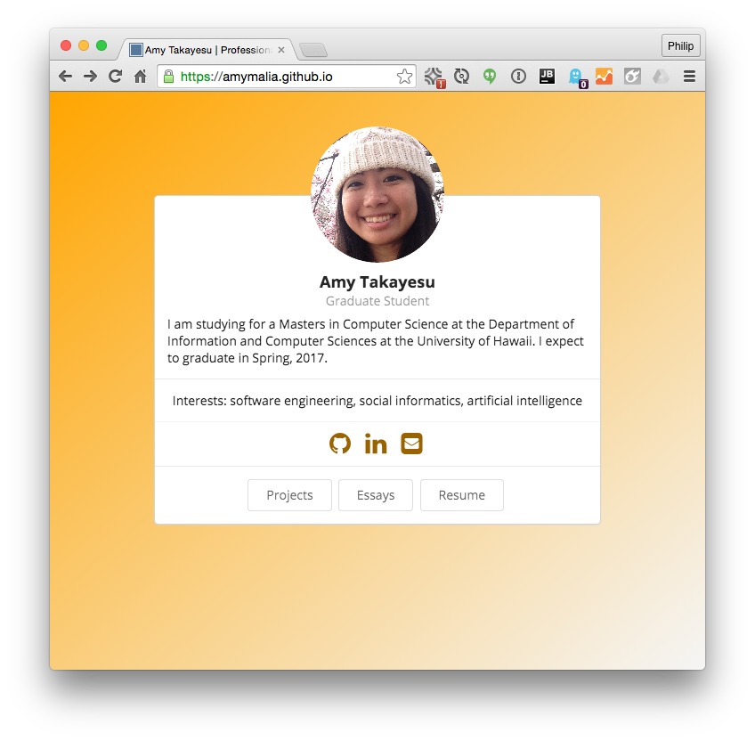

# Announcing Professional Portfolio Workshops 

There is growing evidence that development of a high quality professional portfolio can be as important to your professional future as your actual degree (see [this](http://matt.might.net/articles/what-cs-majors-should-know/), [this](https://www.codementor.io/learn-programming/landing-programming-job-without-computer-science-degree), [this](https://news.ycombinator.com/item?id=9666325), and [this](http://www.techrepublic.com/article/do-programmers-still-need-a-computer-science-degree-to-land-a-great-job/)).
  
The Department of Information and Computer Sciences at the University of Hawaii is delighted to announce a set of three workshops to help you start on the path to a portfolio that will best showcase your skills, interests, and accomplishments. Sixty students have already created professional portfolios that you can review at the [ICS Portfolios site](https://ics-portfolios.github.io). We use [TechFolios](https://techfolios.github.io), a system developed within ICS to help our students present their portfolios in a modern, attractive manner.  

These workshops are open to undergraduate and graduate students in Computer Science or Computer Engineering. You can attend one or more of the workshop depending upon your interests.
  
If you are graduating this academic year and have not yet created a professional portfolio, then these workshops have the potential to significantly improve your job prospects. However, students earlier in their degree program will gain the most from these workshops. If you are a sophomore or junior, start now on your professional portfolio, because it will help you make better use of your remaining time in your degree program!  The less qualified you feel for a professional portfolio, the more benefit you will get from starting one!

### Workshop 1: Portfolio Quick Start
 
*Wednesday, November 2, 2016. 4:30-5:30pm, POST 318B (ICSpace).*  

During the first workshop, we will very quickly overview the elements of a high quality professional portfolio, and then guide you through the [Quick Start Tutorial](../quickstart.html) to implement your professional portfolio using TechFolios.

In addition, a professional photographer has agreed to attend and take headshots free of charge. 

By the end of this session, you will implemented and released a very basic professional portfolio.

If you've already developed a professional portfolio, or decide to go through the Quick Start on your own, you can skip this session and attend Workshop 2.

### Workshop 2: Portfolio Review

*Wednesday, November 9, 2016. 4:30-5:30pm, POST 318B (ICSpace).* 

The goal of this session is to provide detailed review of your portfolio, and brainstorm ways to improve it.  For example, many students have problems thinking of "Projects" to include in their portfolio.  We will work one-on-one with students this week to assess the current state of their portfolio and come up with a set of potential improvements. 
 
This session will be of particular use to students early in their degree program. In addition to assessing ways to improve your current portfolio, we will discuss ways you can leverage your future semesters so that you have an awesome professional portfolio by the time you graduate. 

### Workshop 3: TechFolio Internals Hacking 

*Wednesday, November 16, 2016. 4:30-5:30pm, POST 318B (ICSpace).* 

Do you like TechFolios, but want to distinguish yourself with a totally custom look and feel? Do you want to integrate entirely new functionality into TechFolios? If so, this week is for you.

This final session is for hackers who want to customize their professional portfolio by implementing new themes, Jekyll plugins, Javascript modules, or Semantic UI widgets. 

Come with your vision of what you want to implement into your professional portfolio and we will help you get started making it happen. If your hack is cool, we'd love to include it in a future release of TechFolios.

### Questions?

Please contact Philip Johnson (johnson@hawaii.edu)

 
 

