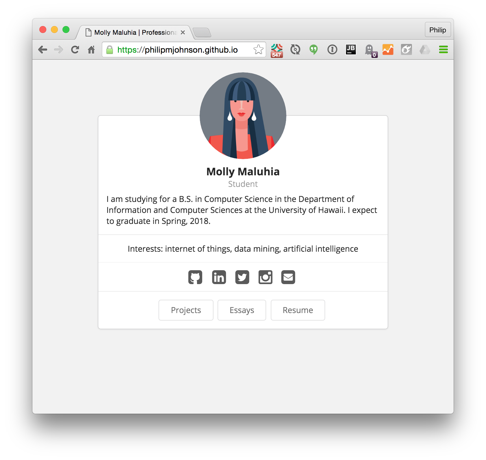
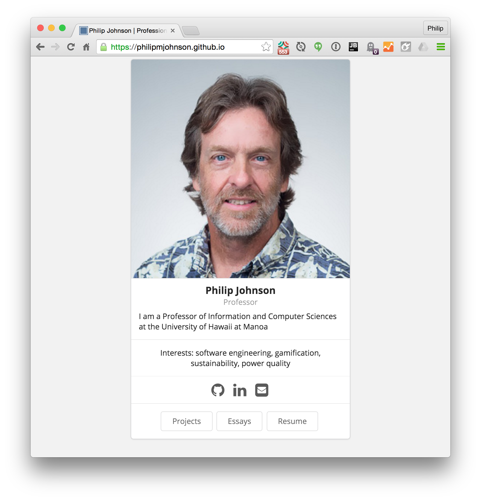
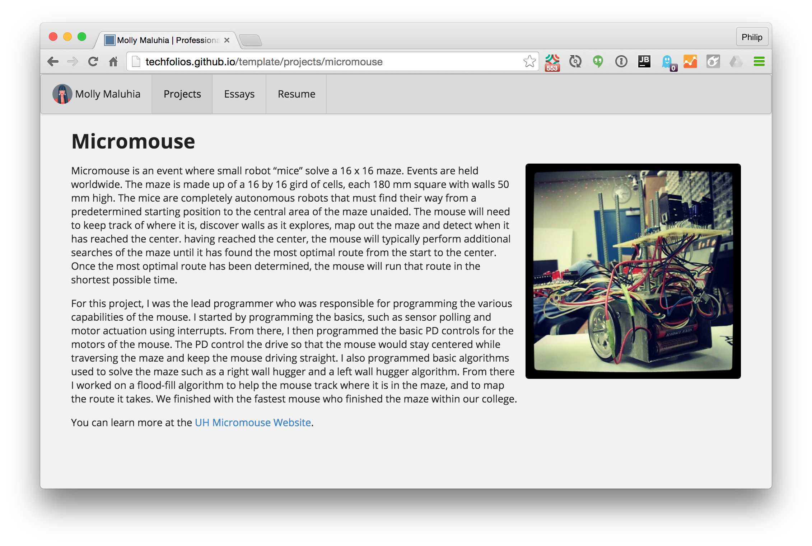
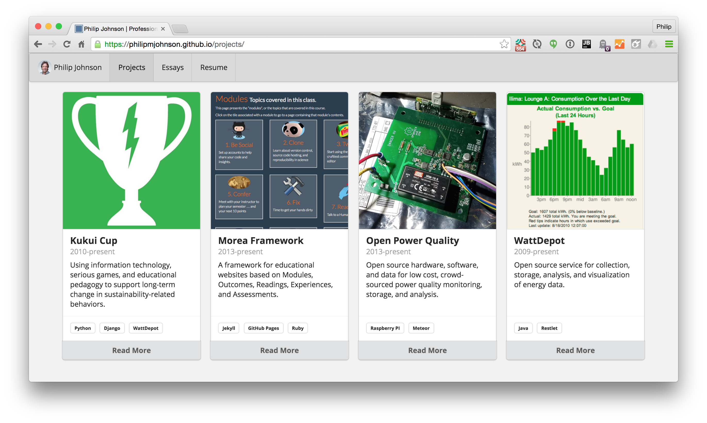
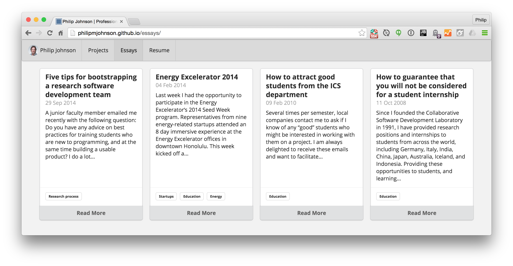
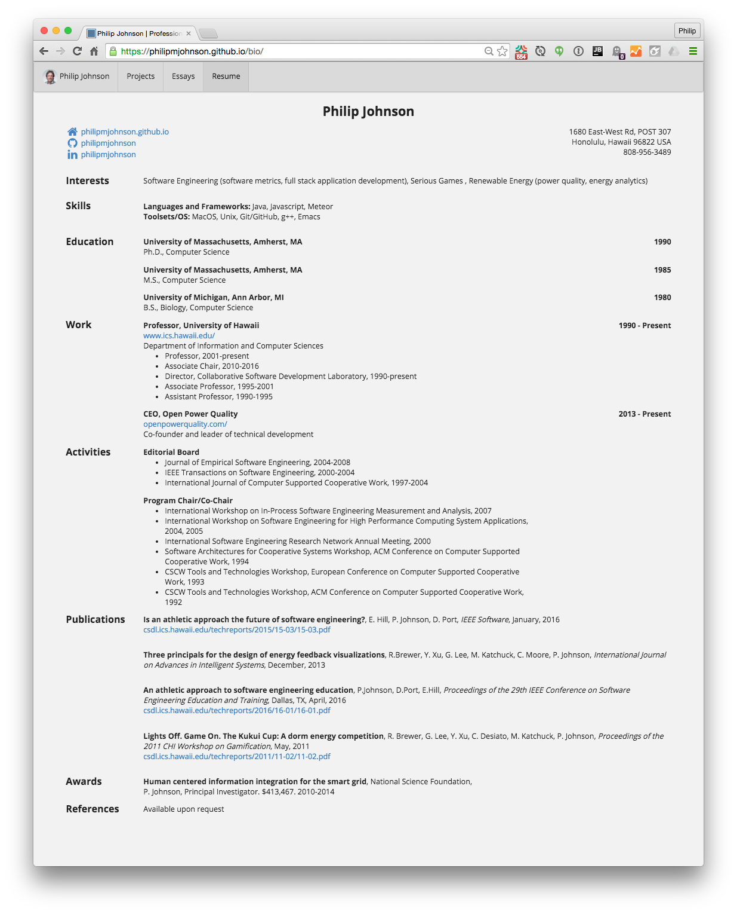
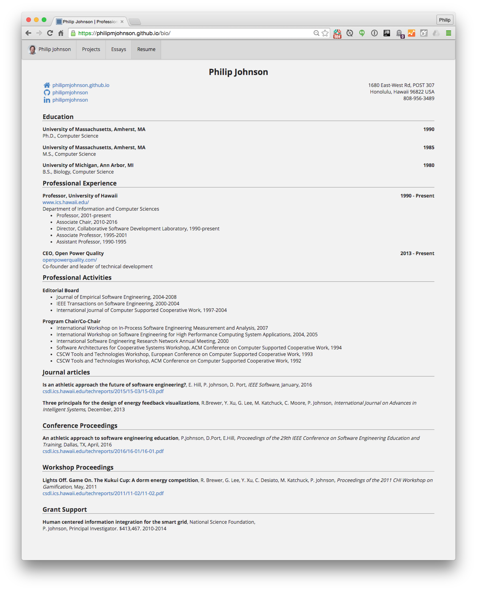
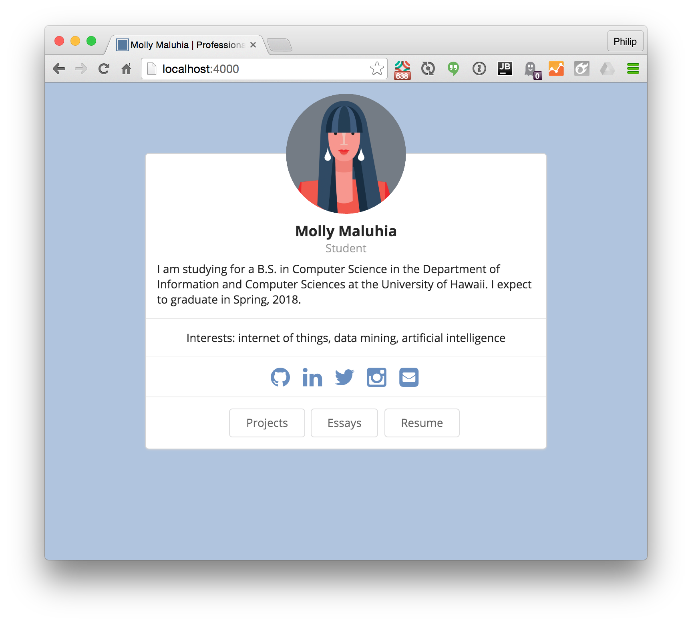
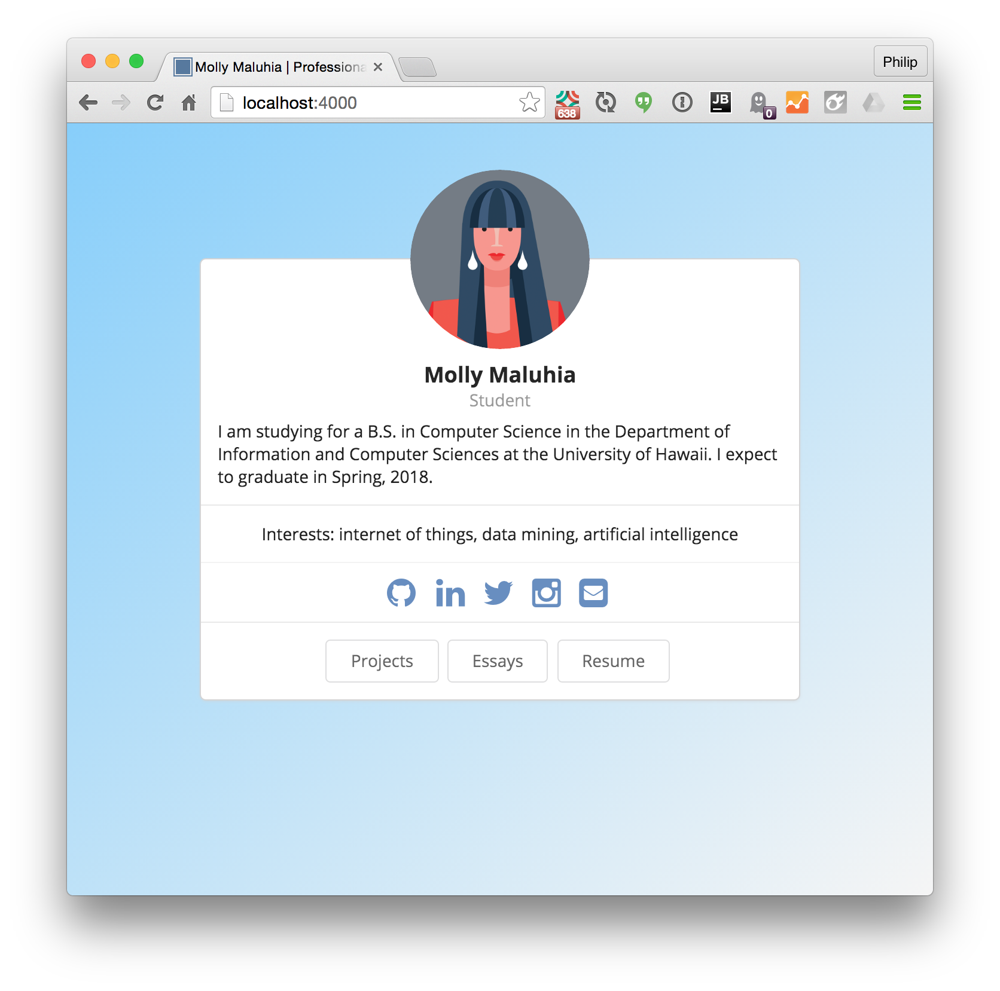

# 1. Join GitHub

To get started with TechFolios, all you need is an account at GitHub. You don't need to download any software or even know how to use git. Everything you need to do when starting out can be done in a browser.  

If you haven't already, [sign up for GitHub](https://help.github.com/articles/signing-up-for-a-new-github-account) and [verify your email address](https://help.github.com/articles/verifying-your-email-address/). Choose your username wisely, as that will become part of the URL to your portfolio site.

Before proceeding, [login](http://github.com/login) to your GitHub account.

# 2. Configure template

In this step, you'll make a personal copy of the TechFolio template and configure it to be displayed as your portfolio. Please watch the following 3 minute video for an overview, then follow the steps below.


 
**A.** Go to [https://github.com/techfolios/template](https://github.com/techfolios/template).
  
**B.** Press the "Fork" button on the top left of the page.
  
**C.** Choose your personal account (if GitHub presents you with a choice). Your browser will now display the home page for your copy of the template.
  
**D.** Click on "Settings" tab (top middle of the screen), and rename the repo from "template" to USERNAME.github.io, where USERNAME is your GitHub account name. Press the "Rename" button to save the new name. This will take you back to the home page. 
  
**E.** Now let's fix the summary line to link to your portfolio. Here's what it looks like now:

```yaml
Technical Portfolio https://techfolios.github.io/template -- Edit
```
     
Click on "Edit" to edit this summary line.   Change "http://techfolios.github.io/template" to "http://USERNAME.github.io/", where USERNAME is your GitHub account name.  **NOTE**: make sure you delete "template" from the URL! Click "Save" to save. When you're done the summary line should look similar to this:

```yaml
Technical Portfolio https://USERNAME.github.io/ -- Edit
```

**F.** Finally, scroll down to the file named "_config.yml".  Click on that file name to display its contents. Click on the pencil button on the top right of the screen to bring up a browser-based editor with the contents of the file. The top section will look like this:
   
```yaml
# REQUIRED CHANGES
# Edit next line, providing your own name.
title: Molly Maluhia | Professional Portfolio
# Edit next line, replacing 'techfolios' with your github username
url: "https://techfolios.github.io"
# Edit next line so that baseurl is "" if your repo is <username>.github.io
baseurl: "/template"
```
     
Edit `title:` to include your own name, edit `url:` to point to your portfolio, and edit `baseurl:` to be the empty string. When you're done editing, that section of _config.yml should look similar to this:
  
```yaml
# REQUIRED CHANGES
# Edit next line, providing your own name.
title: MY NAME | Professional Portfolio
# Edit next line, replacing 'techfolios' with your github username
url: "https://USERNAME.github.io"
# Edit next line so that baseurl is "" if your repo is <username>.github.io
baseurl: ""
```  

Go to the bottom of the page and click "Commit changes" to save these changes.   

**G.** You're done!   If you now click on the link containing your portfolio URL on the summary line, you should see the following page:



Note how the url in this screen image includes a personal GitHub account name.

# 3. Set home page content

It's all well and good to have your own portfolio site, but unless you actually happen to be Molly Maluhia, the next step is to replace the template content with your own.  Let's start with the home page.  Please watch the following 11 minute video for an overview, then follow the steps below.



**A.** First, obtain an image for display.  The requirements for this image are that it is **square** and at least 300px per side. On a Mac, you can [crop an image using Preview](http://osxdaily.com/2014/06/16/crop-image-mac-preview/). (Hold down the shift key while selecting the cropped area to force a square.)  On Windows, you can [crop an image using Photo Gallery](http://windows.microsoft.com/en-us/windows-live/photo-gallery-edit-photos-faq). On Unix, you can [crop an image using Gimp](https://docs.gimp.org/en/gimp-tutorial-quickie-crop.html). 

**B.** Upload this file to the images/ directory.  To do this, click on the "images" link to display that directory. Then press the "Upload files" button, and upload your image file to that directory.

**C.** Edit the `basics`, `profiles`, and `interests` sections of your bio.json file. To do this, click on the "_data" link to display that directory, then click on "bio.json" to display that file. Click on the pencil icon to bring up a browser-based editor.  Edit those three sections with your own data.
  
For the `basics` section, when editing the picture field, be sure to delete the "template" part of the URL, otherwise the image won't be found. If you don't want your phone displayed on the site, you can make it the empty string. 
 
For the `profiles` section, I recommend you include only your "professional" networking sites. For example, you might not want to include facebook if you use that only for personal networking.  You can specify any networking site for which there exists a [Semantic UI brand icon](http://semantic-ui.com/elements/icon.html#brands).

For the 'interests' section, you can include keywords for each interest or leave that field empty.  On the home page, keywords associated with interests do not appear with the built-in templates, but they are used on the resume page.

Once you've finished your edits, click "Commit changes" at the bottom of the page to save.
 
Now refresh your profile page to see your home page, and continue editing bio.json, commiting the changes, and refreshing the page until you are satisfied with the content.  Note that, as shown in the video, sometimes it can take a few seconds for your commits to be reflected in the page.  Here is an example of the home page after configuration in the above video:


# 4. Set home page theme

Now that your home page content is OK, it's possible to explore TechFolio "themes". (If you're content with the current theme, you can skip this section for now.) Please watch the following 3 minute video for an overview, then follow the steps below.



The layout for each of the top-level pages in a TechFolio site (home, projects, essays, bio) is specified in `_config.yml'.  The TechFolio template comes with a few alternative themes for each top-level page that you can try out now.  As you get more experienced with the system, you will find that you can easily create your own variants of these themes to give your site a unique look and feel.
 
To determine the builtin themes, look in the `_includes` directory for all files whose name starts with "theme". You should see at least the following files:

  * theme-bio.builtin-1.html
  * theme-bio.builtin-2.html
  * theme-essays-builtin-1.html
  * theme-essays-builtin-2.html
  * theme-home-builtin-1.html
  * theme-home-builtin-2.html
  * theme-home-builtin-3.html
  * theme-projects-builtin-1.html
  * theme-projects-builtin-2.html
  
These files (and any others you find) define the available builtin themes for each of the four top-level pages. To change the theme associated with any given page, just edit the following section of `_config.yml`:

```yaml
# You might want to change the theme associated with one or more sections of the site.
# Defining your own custom theme variations is easy. See the documentation.
theme-home: theme-home-builtin-1.html
theme-projects: theme-projects-builtin-1.html
theme-essays: theme-essays-builtin-1.html
theme-bio: theme-bio-builtin-1.html
```

Note that you simply provide the file name for the theme of interest, and that you need to "match" the theme type. So, for example, the `theme-home:` keyword can take any file whose name starts with "theme-home" (such as theme-home-builtin-1 or theme-home-builtin-2) but the site will not build correctly if you specify a file not associated with a home theme (such as theme-projects-builtin-1). 

Here is an example of the home page after setting the home page to the third builtin theme:



# 5. Set project content

An important part of any technology portfolio are descriptions of significant projects you've developed or played a significant role in. Please skim the text in this section for an overview, then watch the following 8 minute video to see an example, then add some initial project descriptions, referring back to this documentation as necessary. 



In TechFolios, use the projects/ directory to hold a file for each of your projects.  The template comes with three sample projects in the projects/ directory named project-1.md, project-2.md, and project-3.md.  Here is the template projects top-level page, which provides a summary of all your projects:


Clicking on the "Read More" link associated with a project takes you to its "details" page. Here's an example:



Here's the contents of the project-1.md file used to generate both the project summary and project details:

```markdown
---
layout: project
type: project
published: true
image: images/micromouse.jpg
title: Micromouse
permalink: projects/micromouse
date: 2015
labels:
  - Robotics
  - Arduino
  - C++
summary: My team developed a robotic mouse that won first place in the 2015 UH Micromouse competition.
---


Micromouse is an event where small robot “mice” solve a 16 x 16 maze.  Events are held worldwide.  The maze is made up of a 16 by 16 grid of cells, each 180 mm square with walls 50 mm high.  The mice are completely autonomous robots that must find their way from a predetermined starting position to the central area of the maze unaided.  The mouse will need to keep track of where it is, discover walls as it explores, map out the maze and detect when it has reached the center.  having reached the center, the mouse will typically perform additional searches of the maze until it has found the most optimal route from the start to the center.  Once the most optimal route has been determined, the mouse will run that route in the shortest possible time.

For this project, I was the lead programmer who was responsible for programming the various capabilities of the mouse.  I started by programming the basics, such as sensor polling and motor actuation using interrupts.  From there, I then programmed the basic PD controls for the motors of the mouse.  The PD control the drive so that the mouse would stay centered while traversing the maze and keep the mouse driving straight.  I also programmed basic algorithms used to solve the maze such as a right wall hugger and a left wall hugger algorithm.  From there I worked on a flood-fill algorithm to help the mouse track where it is in the maze, and to map the route it takes.  We finished with the fastest mouse who finished the maze within our college.

You can learn more at the [UH Micromouse Website](http://www-ee.eng.hawaii.edu/~mmouse/about.html).
```

First, note the file contents begin with [Jekyll front matter](https://jekyllrb.com/docs/frontmatter/), which is enclosed between three dashes.  The Jekyll front matter provides all of the information needed to generate the project summary: the project name, summary text, labels, the image file, the date, and the permalink (which becomes the URL to the detailed description). 

Second, note that your project file names should end with ".md".  This indicates to the system that the contents of the file are in [GitHub flavored markdown](https://help.github.com/articles/basic-writing-and-formatting-syntax/). For the most part, the template files provide examples of the required syntax and you might not even need to refer to the documentation.

Third, you must provide a square image of at least 300px on a side for each project. We recommend you upload those project images to the images/ directory, just like you uploaded your home page image. The template system provides examples.
  
Fourth, Techfolio generates the set of projects by processing every \*.md file in your site that has `type: project` in its front matter. (By convention, store all of those files in the projects/ directory.) 

Fifth, as illustrated above, each project summary contains a link to a page with more details about the project. TechFolio provides you with two options for project details. 

  1. *Provide details in the \*.md file.* You can provide the detailed description of a project directly in the \*.md file as text below the front matter section.  This is illustrated above.
    
  2. *Provide details via a link to the project's home page.*  Some projects might have their own home page, such as a GitHub repo, which is the authoritative source for project details.  In this case, it might be most appropriate for your project summary to link directly to that home page rather than you writing a redundant description in the \*.md file.  To support this, you can provide a field called `projecturl:` in the front matter of the \*.md file whose value is the URL to the external site.  If this field is present, it is used as the link on the project summary page. See the video for examples of this approach. 
    

Here is an example of the projects page after the content was set as in the video above:
 


# 6. Set projects page theme

Exactly similar to the home page, you can edit the `_config.yml` page to specify the theme for the project summary page.  If you like, spend a minute or two now to check out an alternative layout for project summaries. 

# 7. Set essay content

Since TechFolio is built on Jekyll, it provides excellent infrastructure for "blogging". However, we will use the more professional term "technical essay". Please skim the text in this section for an overview, then watch the following 4 minute video to see an example, then add some initial essays, referring back to this documentation as necessary. 




Essays are similar to projects in the following ways:
 
   * Each essay is stored in its own \*.md file.
   * It does not matter what the file name is, as long as it ends with ".md".
   * Just as the system identifies a project through the `type: project` field in a file's front matter, the system identifies essays through `type: essay` in a file's front matter.
   
Essays are different from projects in the following ways:
  
   * The essay contents must be provided following the front matter.  An essay summary cannot link to an external site for more information (such as is possible with the `projecturl:` field).
   * The summary description of an essay is automatically generated from the first 40 words in the essay. You do not put a summary in the front matter.
   * Images are not required for essays.
   * Essays must have a date field (YYYY-MM-DD) in the front matter section. This field is used to list the essay summaries in reverse chronological order.
   
Here is an essay file from the template site to give you an idea of its structure:
 
```markdown
---
layout: essay
type: essay
published: true
title: Igniting the fire
date: 2015-08-26
labels:
  - Software Engineering
  - Learning
---

Ever since I first grasped a paintbrush, I’ve always been eager to learn about design. Design is such a complex concept. For example, when looking at abstract art, its meaning can be completely different for different people. It motivates a person to think thoughtfully and has the potential to submerge them in a sea of imagination. It’s that special relationship between the viewer and the art that makes something as technical as software engineering interesting to me.

I never used to think that design and technology went hand in hand.  Thus, learning about software engineering and the role of design has been incredibly interesting to me. Design, implementation, and management are just some of the many things I wish to learn more about. Good art, in a way, makes a person question it. They become joined in the idea of visualization – where captivation meets inspiration.

I am now starting to take a Software Engineering class. I hope to learn a lot through the course, but I know it will be just the beginning of my journey. By the time I’m done with it, I hope I’ve learned enough to take the next step in my life as a developer. But until then, my fire will keep on burning.

```

Here is an example of the essays page after the content was set as in the video above:
   
  
   
# 8. Set essays page theme

Exactly similar to the home and projects pages, you can edit the `_config.yml` page to specify the theme for the essays page.  If you like, spend a minute or two now to check out an alternative layout. 

# 9. Set bio content

The last section of the site to personalize is the "bio" page.  The bio page renders the data in the `_data/bio.json` file which you partially customized at the beginning of this Quick Start in order to set the content for the Home Page.  In order for the bio page to render appropriately, it is now time for you to edit the remaining fields in this file. 

TechFolio calls this a bio page because academic technologists provide biographical data in the form of a "CV", while industry-oriented technologists provide biographical data as a "Resume".  The distinction is deeper than just the term: the structure and content of a CV is actually quite different from that of a resume. 

TechFolio tries to support the presentation of biographical data in either CV or Resume format through the use of themes.  The "theme-bio-builtin-1" theme creates a bio page that presents the data in bio.json in a style typical of a resume. The "theme-bio-builtin-2" also presents the data in bio.json, but this time in a style typical of a resume. *We expect that many users will want to create custom themes based on one of these two starting points in order to best present their biographical data.*

A concrete example will help the differences in these two approaches clear.  Here is a sample bio.json file presented using theme-bio-builtin-1, the resume-oriented format:



Note that:

  * The resume format starts with "Interests" and "Skills"
  * No distinction is made between various kinds of publications.
  * The resume ends with a references section.
  * All types of awards are listed together.
  
Here is the same bio.json data presented using theme-bio-builtin-2, the CV-oriented format:



Note that:

  * "Interests", "Skills", and "References" are omitted
  * Journal articles, conference publications, workshops, and technical reports get their own sections.
  * Awards involving funding ("grants") are listed separately from other awards.
  
Finally, you can configure the label used on the home page to link to the bio page in `_config.yml`.  It defaults to "Resume", but if you prefer, you can change the displayed label to "CV". 

To set the bio content, we recommend you start with either the template bio.json file (if you are a student and want a resume format) or [Philip Johnson's bio.json file](https://raw.githubusercontent.com/philipmjohnson/philipmjohnson.github.io/master/_data/bio.json) if you want a CV-style presentation. The latter file adds fields to various sections in order to support the CV format. 

It's probably not useful to watch a video of me editing a bio.  Instead, here are some tips:

  * If you have a favorite editor, you might want to copy the bio.json file out of your browser and into your editor to edit. Try to maintain the indentation as a way of ensuring that the file continues to be structured appropriately.
  
  * Commit and test your changes to bio.json frequently.  That way, if you make an error with a section, you can easily revert to a recent version that works. (Use the GitHub "History" button to see all prior versions of a single file.)
  
  * The bio.json file should conform to the [JSON Resume Schema format](http://lbovet.github.io/docson/index.html#https://raw.githubusercontent.com/jsonresume/resume-schema/v1.0.0/schema.json), although the CV builtin format looks for some additional fields in order to differentiate between publication and award types.
  
  * If GitHub emails you that an error occurred when trying to generate the site after committing a new version of bio.json, try cutting and pasting your bio.json file into [YAML Lint](http://www.yamllint.com/).  In general, if the GitHub page generator fails, it's because something in file prevented it from converting the JSON into YAML. 
   
   * If all else fails, use the [Help Page](help.html) to request support. It will almost always be a very easy mistake to fix.

Once your bio.json file is set up correctly, you may want to adjust the theme so that the page renders exactly how you want it.  That will be covered later as part of the User Guide.

# 10. Adjust colors

The template portfolio has a very neutral gray theme.  If you want to add some color to your portfolio without extensive changes to the themes, then the easiest approach is to modify the css/stylesheet-customizations.scss file. Whatever you put into this file will override the defaults without requiring you to modify built-in CSS. 

The stylesheet-customizations.scss file provides hints for how to modify colors without actually doing so:

```sass
---
# Provide front matter so Jekyll processes this file as SASS.
---

// Put your custom CSS here if you want to override the defaults.
// Here are some common customizations for colors

// Customize the background color
body {
  // background-color: #f2f2f2;;
}

// Customize the menubar color
.ui.menu {
  // background: $background-start;
}

// Customize the home page icon colors
.icon-color {
  // color: silver;
}
```

Currently, it is not easy to create an attractive site using dark background colors. I recommend you stick to a light background color if you want to move away from the default gray. For example, here's a version of stylesheet-customizations.scss using a few shades of light blue:

```sass
---
# Provide front matter so Jekyll processes this file as SASS.
---

// Put your custom CSS here if you want to override the defaults.
// Here are some common customizations for colors

// Customize the background color
body {
  background-color: lightsteelblue;
}

// Customize the menubar color
.ui.menu {
  background: lightskyblue;
}

// Customize the home page icon colors
.icon-color {
  color: darken(lightsteelblue, 20%);
}
```

Here's what the home page looks like with this scheme:



Notice that because this is SASS and not CSS, we can "darken" lightsteelblue by 20% to color the home page social network icons.
 
Another way to add some interest is through the use of gradients.  Here's a version, also with blue:
   
```sass
---
# Provide front matter so Jekyll processes this file as SASS.
---

// Put your custom CSS here if you want to override the defaults.
// Here are some common customizations for colors

// Customize the background color
body {
  background: linear-gradient(to bottom right, lightskyblue, whitesmoke);
}

// Customize the menubar color
.ui.menu {
  background: lightskyblue;
}

// Customize the home page icon colors
.icon-color {
  color: darken(lightsteelblue, 20%);
}
```
Here's the result:



If you stick to light colors and either a solid background or subtle gradient, you can add some personality to your portfolio without detracting from the content. 


<hr>

<p style="text-align: center; padding-top: 10px">
  <a href="/userguide.html" class="btn btn-primary btn-md" role="button">Go to User Guide <span class="glyphicon glyphicon-chevron-right"></span> </a>
</p>


