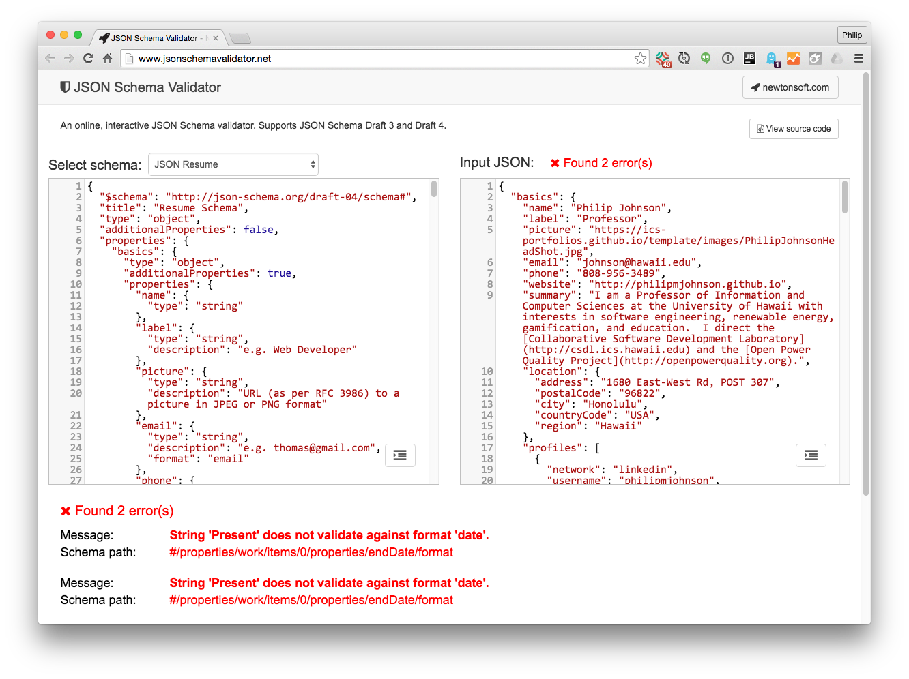
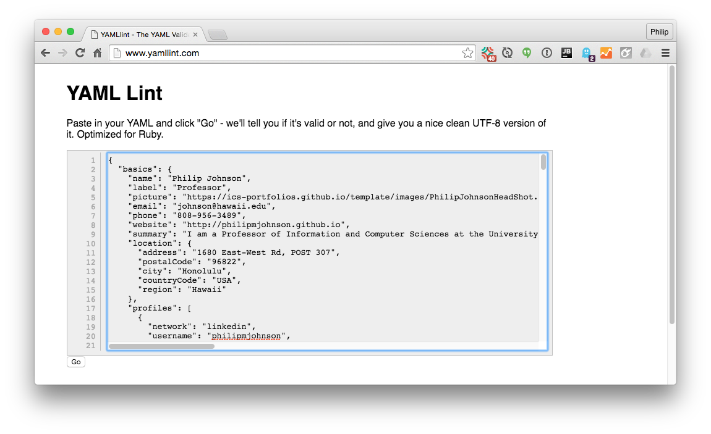
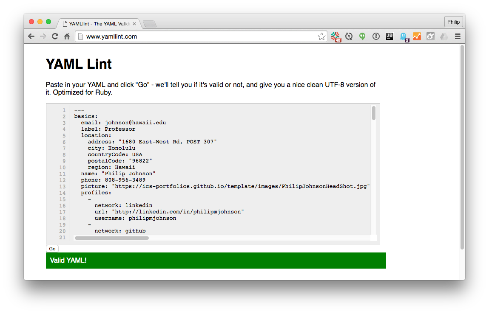
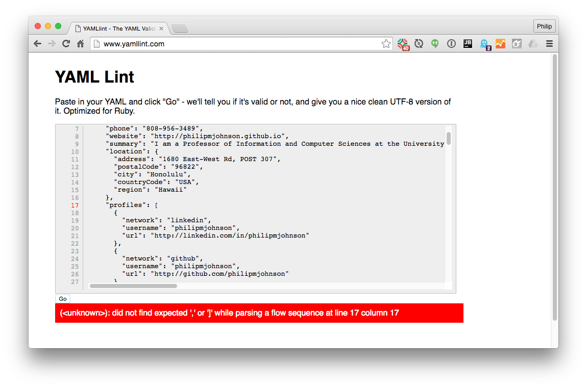

<p style="padding-top: 20px">This User Guide provides tips on how to increase your effectiveness at building and maintaining your portfolio after mastering the directions in the QuickStart.</p>

# 1. Develop locally

The [QuickStart page](/quickstart.html) shows you how to create and edit your portfolio "in the cloud" using only a browser. While this is a simple way to get started, there are some advantages to developing your portfolio locally:

  * You can use your favorite text editor or IDE for writing (Emacs, Eclipse, IntelliJ Idea, etc.). Note: do not use Microsoft Word! 
  * After installing Jekyll, you can build and review the site instantly on your computer after making changes. 
  
There are two components to developing your techfolio locally: (1) managing a local copy of your portfolio repo, and (2) running Jekyll locally to build your site.  

### 1.1 Manage your files locally

To manage your portfolio repo on your computer, you will need to acquire basic familiarity with [git](https://git-scm.com/) and its implementation in GitHub.  

While teaching you about git and GitHub is beyond the scope of this User Guide, here are some pointers to get you started:

  * [GitHub Hello World Guide](https://guides.github.com/activities/hello-world/). An introduction to managing GitHub repositories.
  * [GitHub Tutorial for Beginners](https://www.youtube.com/watch?v=0fKg7e37bQE). A 20 minute introduction to git and GitHub. 
  * [GitHub Desktop](https://desktop.github.com/). A desktop application to simplify basic git tasks for cloning repos and committing changes.
 
Although git can get really complicated really quickly, you only need to know enough to do the following:

  * Clone your GitHub techfolio repo onto your local computer.
  * Edit your techfolio files locally.
  * Commit your local changes to GitHub.
  
Once you understand the basics of git and its implementation in GitHub, you no longer need to use a browser to edit your portfolio files. Instead, you can create or edit portfolio files on your computer using your favorite editor, then commit those files to GitHub.  GitHub will then invoke Jekyll to rebuild your site and you can see the results in your browser. 
 
### 1.2 Build your site locally

Once you are able to manage a local copy of your portfolio files on your computer, you can now install Jekyll so that you can build and review your site without committing to GitHub. 
 
First, follow the [Jekyll installation instructions](https://jekyllrb.com/docs/installation/).

Second, open a shell window, cd into your portfolio directory, and run the following command:

```sh
jekyll serve --baseurl ''
```

Third, open a browser and go to [http://localhost:4000](http://localhost:4000).  You should see the home page of your site. 

# 2. Getting updates

When you fork the TechFolio [template repository](https://github.com/techfolios/template) while following the QuickStart, you create your own "snapshot" of that template code.  However, the template code will occasionally be updated with new themes or other improvements. Major improvements to the template will be publicized in the [News Page](/news.html), so you can check there occasionally to see if there are updates to the template. 

To incorporate an updated template into your own portfolio, you have to create a copy of your GitHub repo on your local computer, merge the updated template repo into your local copy of your portfolio, then push your updated local copy back to GitHub. 

First, follow the instructions in [Manage your portfolio files locally](/userguide.html#Manageyourportfoliofileslocally) to obtain a local copy of your portfolio files on your computer.

Second, open a command shell, and cd into your portfolio directory. You will execute `git fetch techfolios` to obtain the techfolio template updates, `git merge techfolios/master -m "Merge techfolio template into master."` to integrate them into your local portfolio files, and `git push origin master` to push your newly updated portfolio files back to GitHub. Here's a sample session illustrating what it should look like:

```sh
[~/philipmjohnson.github.io]-> git fetch techfolios
remote: Counting objects: 5, done.
remote: Compressing objects: 100% (5/5), done.
remote: Total 5 (delta 1), reused 0 (delta 0), pack-reused 0
Unpacking objects: 100% (5/5), done.
From https://github.com/techfolios/template
   176ab3c..e6617b5  gh-pages   -> techfolios/gh-pages
   f15fe5c..c3a508c  master     -> techfolios/master
   
[~/philipmjohnson.github.io]-> git merge techfolios/master -m "Merge techfolio template into master."
Merge made by the 'recursive' strategy.
 _includes/theme-essays-builtin-2.html | 2 --
 1 file changed, 2 deletions(-)

[~/philipmjohnson.github.io]-> git push origin master
Counting objects: 27, done.
Delta compression using up to 8 threads.
Compressing objects: 100% (27/27), done.
Writing objects: 100% (27/27), 2.57 KiB | 0 bytes/s, done.
Total 27 (delta 21), reused 0 (delta 0)
To https://github.com/philipmjohnson/philipmjohnson.github.io.git
   1656f1f..5a3bba7  master -> master
```

For more details on this process, consult [Syncing a fork on GitHub](https://help.github.com/articles/syncing-a-fork/). Note that the template repository will already be set as an upstream repository with the name "techfolios". You can see this by executing the `git remote -v` command:

```sh
[~/philipmjohnson.github.io]-> git remote -v
origin	https://github.com/philipmjohnson/philipmjohnson.github.io.git (fetch)
origin	https://github.com/philipmjohnson/philipmjohnson.github.io.git (push)
techfolios	https://github.com/techfolios/template.git (fetch)
techfolios	https://github.com/techfolios/template.git (push)
```

In rare cases, the merge command will indicate conflicts. In this case, you will need to resolve the conflicts, commit your changed files, and then push the results.  See the [Help](/help.html) page if you need assistance. 

# 3. Anatomy of bio.json

One of the trickier aspects of TechFolios is the bio.json file, because: (a) it has a fairly rigid syntax, and (b) if you create a syntax error while following the QuickStart, in some cases your only clue is that your site fails to display with your updates.

Fortunately, it is quite easy to diagnose and fix bio.json problems.  First, let's take a quick look at the format.

###  3.1 JSON format

If you haven't worked with JSON formatted files before, all you really need to understand for TechFolios is that the bio.json file is a combination of `objects` and `arrays`.  Objects are key-value pairs enclosed by curly braces, for example:

```json
{
  "name" : "Philip Johnson",
  "address" : "1680 East-West Road"
}
```
This object has two keys ("name" and "address"), each with corresponding values ("Philip Johnson" and "1680 East-West Road"). There is always a colon between a key and its value. 

**Note:** key-value pairs must be separated with a comma!  This is one common syntax error in bio.json.

The second construct creates lists of values, or arrays:

```json
[
  "blue",
  "red",
  "green"
]
```
The difference between objects and arrays is that arrays are defined using square brackets and consist of a list of elements separated by commas.

**Note:** each element in a list must be separated with a comma!  This is another common syntax error in bio.json.

What makes JSON files complex is that you can combine objects and arrays. For example:

```json
{
  "name" : "Philip Johnson",
  "address" : ["1680 East West Road", "Honolulu", "HI", "96822"] 
}
```
Here we have an object where the value associated with the address key is an array.

A final comment: in JSON format, newlines and indentation are not significant. You could have the entire bio.json file on a single line and it would still be a legal file (although not very readable by humans). By convention, the bio.json file uses two space indentation.
 
### 3.2 Structure of bio.json

The bio.json file format is based on [JSONResume](https://jsonresume.org/). Here is the top-level structure:

```sh
{
  "basics" : { <basic profile information> },
  "work" : [ { work object }, { work object }, ... ],
  "volunteer" : [ { volunteer object }, { volunteer object }, ... ],
  "education" : [ { education object }, { education object }, ... ],
  "awards" : [ {  award object }, { award object }, ... ],
  "publications" : [ { publication object }, { publication object }, ... ],
  "skills" : [ { skill object }, { skill object }, ... ],
  "interests" : [ { interest object }, { interest object }, ... ],
}
```
It's really pretty easy: apart from the first section ("basics"), all of the remaining sections are simply arrays of objects, where each object has a structure appropriate for the section. 

Let's look at examples of each section.
 
#### 3.2.1 Basics section

First, here's a sample value associated with the "basics" keyword:

```sh
{
  "name": "Philip Johnson",
  "label": "Professor",
  "picture": "https://philipmjohnson.github.io/images/philip.jpg",
  "email": "johnson@hawaii.edu",
  "phone": "808-956-3489",
  "website": "https://philipmjohnson.github.io",
  "summary": "I am a Professor of Information and Computer Sciences at the University of Hawaii.",
  "location": {
    "address": "1680 East-West Rd, POST 307",
    "postalCode": "96822",
    "city": "Honolulu",
    "countryCode": "USA",
    "region": "Hawaii"
  },
  "profiles": [
    {
      "network": "github",
      "username": "philipmjohnson",
      "url": "http://github.com/philipmjohnson"
    },
    {
      "network": "linkedin",
      "username": "philipmjohnson",
      "url": "http://linkedin.com/in/philipmjohnson"
    }
  ]
}
```

**Note:** In the "profiles" section, each of the social network objects must be separated by a comma (since they are in an array).  If you add a new social network object, make sure that a comma separates it from the previous and next object.

#### 3.2.2 Work section

Here's an example of the value associated with the "work" keyword:

```sh
[
  {
    "company": "University of Hawaii",
    "position": "Professor",
    "website": "http://www.ics.hawaii.edu/",
    "startDate": "1990-08-01",
    "endDate": "Present",
    "summary": "Department of Information and Computer Sciences",
    "highlights": [
      "Professor, 2001-present",
      "Associate Chair, 2010-2016",
      "Director, Collaborative Software Development Laboratory, 1990-present",
      "Associate Professor, 1995-2001",
      "Assistant Professor, 1990-1995"
    ]
  },
  {
    "company": "Open Power Quality",
    "position": "CEO",
    "website": "https://openpowerquality.com/",
    "startDate": "2013-01-01",
    "endDate": "Present",
    "summary": "Co-founder and leader of technical development",
    "highlights": [  ]   
  }
]
```
Unlike the "basics" keyword whose value is an object, the value associated with the "work" keyword is an array.

This array contains a list of objects, where each object has keys for company, position, website, etc.

**Note:** If you add or subtract work objects, be sure that each object is separated from each other by a comma.

#### 3.2.3 Education section

All of the remaining sections are pretty much like the work section: an array of objects whose keys are appropriate for the information being presented. For example, here's a sample value associated with the "education" keyword:

```sh
[
  {
    "institution": "University of Massachusetts, Amherst, MA",
    "area": "Computer Science",
    "studyType": "Ph.D.",
    "endDate": "1990-08-01",
    "gpa": "",
    "courses": [
    ]
  },
  {
    "institution": "University of Massachusetts, Amherst, MA",
    "area": "Computer Science",
    "studyType": "M.S.",
    "endDate": "1985-06-01",
    "gpa": "",
    "courses": [
    ]
  }
]
```
Again, when editing this section, make sure the individual education objects are separated by commas.

### 3.3 Debugging bio.json

OK, so let's say you edited bio.json in your browser, committed the file, and after waiting 30 seconds or so, your profile site is not displaying with your changes. What's wrong? 

The most likely answer is that you have somehow forgotten to add a comma or made some other simple syntax error in your bio.json file. Now the question is: how to track down that error? 

There are two simple steps to take: (1) validate your file against the JSON Resume schema, and (2) check that Jekyll can process the bio.json file.
 
#### 3.3.1 Validate against the schema

First, you can try cutting and pasting your bio.json file contents into [JSON Schema Validator](http://www.jsonschemavalidator.net/). Here's what the result of running it looks like:



Note that the validator can signal errors related to certain "date" fields. This is OK for TechFolios; our themes try to do the right thing when "Present" is provided as a date string. 

However, if any other kinds of errors are signalled, then this indicates a potential bug in your bio.json file. Fix the errors and go on to the second stage of validation below.

#### 3.3.2 Validate against Jekyll (YAML Lint)

Once your bio.json file is found to be valid against the JSONResume schema, the next step is to see if Jekyll can process it correctly. To do so, you can use [YAML Lint](http://www.yamllint.com/).  Paste your bio.json file into the text field and see if errors occur. Here's what the page looks like right after pasting in a bio.json file:



Here's what happens after pressing "go"--the JSON is converted to YAML, and the page provides a green bar if no errors occurred:



Let's say you forgot a comma when editing your social network entries. Here's what YAML Lint might produce:



YAML Lint will indicate an error and the top-level section in which the error occurred ("profiles"). It won't always tell you the exact line but hopefully the error message will give you enough information to track down the error.

Once your bio.json file passes both JSON Schema and YAML Lint, it should build without problem in TechFolio.

# 4. Custom design tips

If you want to create your own custom themes, you need to become familiar with two facilities: Jekyll templates and Semantic UI.

### 4.1 Jekyll Templates

TechFolio is based on [Jekyll](https://jekyllrb.com/).  Each of the pages are built using [Jekyll Templates](https://jekyllrb.com/docs/templates/), which in turn are based on the [Liquid Template Language](https://github.com/Shopify/liquid/wiki).

We recommend that when defining a new theme, make a copy of an existing, working theme, and then start modifying it. Use the above links as reference when you want to do something where there is no existing sample code illustrating how to accomplish it.

### 4.2 Semantic UI

TechFolio uses [Semantic UI](http://semantic-ui.com/) as its CSS framework.  See the Semantic UI documentation for details on this framework. Currently TechFolio uses Version 2.1.

